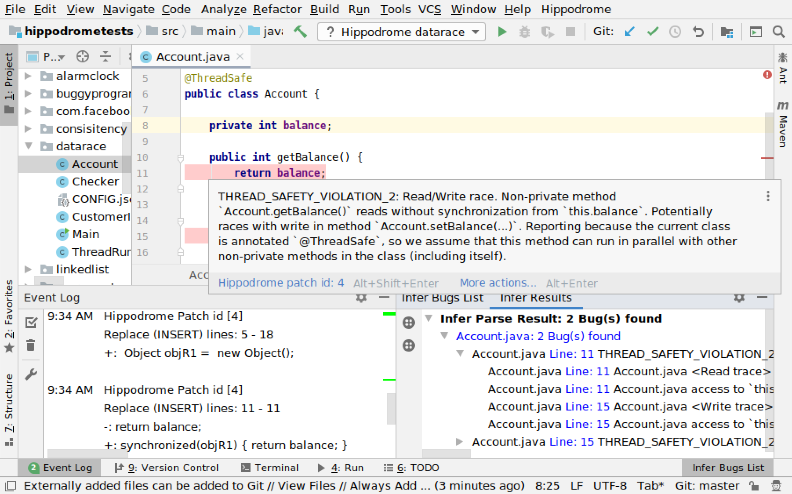

SimpleInfer is an IntelliJ plugin designed for Hippodrome, allowing it to be run and presents its fixes to be applied in a simple manner. Can also be run with an installation of Infer and display its results.

## Prerequisites

1. IntellIJ IDEA 2019 (tested on this version, should work for other versions too)
2. An installation of [Hippodrome](https://github.com/andrecostea/hippodrome/) or [Infer](https://fbinfer.com/docs/getting-started/)

## Installation

1. Go to the Releases section and download the latest zip
2. Open IntelliJ IDEA
3. In IntelliJ IDEA, go to File -> Settings and select Plugins. (In macOS, go to IntelliJ IDEA -> Preferences and select Plugins)
4. Click Install plugin from disc button and select the deployed plugin zip file
5. Restart IntelliJ IDEA

## Usage

1. Add a Run configuration of the type "Hippodrome" and change the "run command" parameter (example: "hippodrome --config_file=CONFIG.json" or "infer run -- mvn compile"
2. Run the configuration
3. A panel with the name "Infer Bugs List" should appear, displaying the resulting bugs
4. To apply the fixes, go to the location of the bugs, then place your mouse cursor over the highlighted errors. This will show a popup with an options to apply Hippodrome patches.